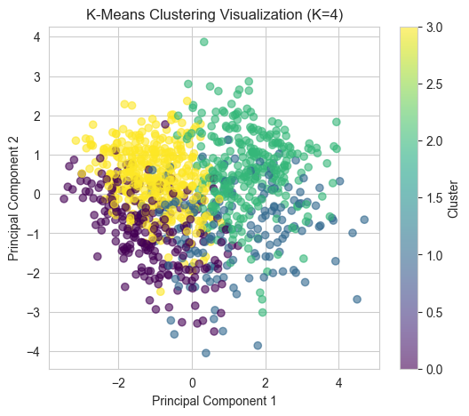

# 🧠 Clustering Patient Profiles to Identify Heart Disease Risk Patterns

This project uses **Unsupervised machine learning** using K-Means, DBSCAN, and Hierarchical clustering on a Kaggle heart disease dataset. PCA and EDA for data pre‑processing and visualization. Evaluation via Silhouette Score & Davies‑Bouldin to identify high-risk patient groups for personalized preventive healthcare.

## 🩺 Project Overview

Cardiovascular disease remains a leading global health risk. This project applies **unsupervised machine learning** to a publicly available Kaggle heart disease dataset to uncover hidden patient risk profiles. Using **K-Means**, **DBSCAN**, and **Hierarchical Clustering**, the analysis segments patients into four distinct clusters—including outliers—for potential early intervention and personalized healthcare planning.

**Methodology Highlights:**
- ✅ Encoded and normalized data (Z-score standardization)
- 🔍 Explored features and relationships via correlation analysis and PCA
- 📈 Determined cluster count using the elbow method and validated clustering quality using **Silhouette Score** and **Davies–Bouldin Index**
- 📊 Visualized results through PCA scatterplots, dendrograms, heatmaps, and elbow curves for interpretability

**Key Contributions:**
- Demonstrates that **unsupervised clustering can effectively stratify patient risk groups without labeled data**
- Combines multiple algorithms for robust identification of high-risk clusters and outliers
- Provides clear, interpretable visuals to support data-driven healthcare insights

The pipeline covers:
- ✅ **Data preparation**: Handling encoding and applying Z-score normalization  
- 🔍 **Exploratory analysis**: PCA dimensionality reduction and feature correlation assessment  
- 🧠 **Clustering evaluation**: Assessing models using **Silhouette Score** and **Davies–Bouldin Index**  
- 📈 **Interpretability**: Visualizing clusters via PCA scatterplots, elbow curve, dendrograms, and heatmaps

**Key Contributions:**
- Demonstrated how unsupervised learning can stratify patient risk groups without needing labeled outcomes  
- Combined complementary algorithms to validate high-risk clusters and isolate outliers  
- Provided clear, interpretable visualizations supporting a data-driven approach to preventive healthcare  

## 📊 Dataset

- **Source**: [Kaggle - Heart Disease Dataset](https://www.kaggle.com/datasets/hosammhmdali/heart-disease-dataset)
- **Features**: Age, Cholesterol, Blood Pressure, ECG results, Exercise-induced angina, and more
- **Rows**: 1,048 records  
- **Target**: No labeled target — unsupervised clustering based on risk factors

## 🔍 Problem Statement

Traditional diagnostic approaches often miss subtle relationships between risk factors. This project explores whether **unsupervised learning** (clustering) can detect hidden patterns that identify patient risk levels for heart disease.

## ⚙️ Techniques Used

- Data Preprocessing: Encoding, Normalization (Z-score)
- **EDA**: Correlation analysis, statistical summaries
- **Dimensionality Reduction**: PCA (Principal Component Analysis)
- **Clustering Algorithms**:
  - K-Means Clustering
  - DBSCAN (Density-Based)
  - Hierarchical Clustering (Agglomerative)
- **Evaluation Metrics**: Silhouette Score, Davies-Bouldin Index
- **Visualization**: PCA plots, Heatmaps, Dendrograms

## 📈 Key Results

- K-Means performed best for cluster separation and interpretability
- DBSCAN identified outliers (extreme-risk patients)
- Hierarchical clustering showed relationships between risk levels
- Four distinct patient risk groups were identified based on features like **cholesterol**, **oldpeak**, and **exercise-induced angina**

## 📸 Visualizations

### 📍 PCA Visualization
Shows how high-dimensional data was reduced to 2D space.

### 📍 Elbow Method
Used to determine the optimal number of clusters for K-Means.

### 📍 K-Means Clustering Result
Well-separated patient groups based on risk profiles.

### 📍 DBSCAN Clustering Result
Highlights outliers with irregular risk patterns.

### 📍 Hierarchical Clustering Dendrogram
Shows how patient groups are nested by similarity.

### 📍 Correlation Heatmap
Displays relationships between heart disease risk factors.

## 🧪 How to Run

1. Download the `.ipynb` file from this repo
2. Open with **Jupyter Notebook**, **VS Code**, or **Google Colab**
3. Run the cells in order to reproduce data preprocessing, clustering, and visualizations

## 💡 Future Work

- Include more features: lifestyle, family history, medications
- Apply t-SNE/UMAP for deeper visual insights
- Validate clusters with clinical experts

## 👩‍💻 Author

**Sushma Dadi**  
Graduate Student, MS in Information Technology  
[LinkedIn](https://www.linkedin.com/in/sushmareddy-d)

